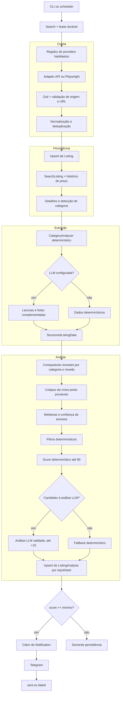

# AI Deal Finder

Serviço self-hosted em Node.js e TypeScript para experimentar descoberta autorizada de anúncios, histórico de preços e ranqueamento de oportunidades com regras determinísticas, estatística e integração opcional com LLM e Telegram.

> [!IMPORTANT]
> Este é um projeto independente de portfólio. Ele não é afiliado, patrocinado nem aprovado por Meta/Facebook, OLX ou Mercado Livre. Uma conta válida, um token ou uma sessão autenticada não constituem autorização para coleta automatizada.

O projeto foi desenhado para uso pessoal, autorizado e de baixo volume. Não implementa compra automática, CAPTCHA bypass, evasão de bloqueios, mascaramento de automação ou acesso não autorizado. O score é uma heurística de triagem, não uma avaliação financeira, de autenticidade, procedência ou segurança do negócio.

## Sumário

- [Proposta e escopo](#proposta-e-escopo)
- [Status real](#status-real)
- [Diferenciais técnicos](#diferenciais-técnicos)
- [Arquitetura](#arquitetura)
- [Pipeline ponta a ponta](#pipeline-ponta-a-ponta)
- [Modelo de dados](#modelo-de-dados)
- [Instalação no host](#início-rápido-no-host)
- [Instalação com Docker](#início-rápido-com-docker)
- [Configuração](#configuração-por-grupos)
- [Comandos](#comandos)
- [Login gráfico e VNC](#login-gráfico-e-vnc-seguro)
- [Atualizações e migrations](#atualizações-e-migrations)
- [Testes e CI](#testes-ci-e-cobertura)
- [Segurança e compliance](#segurança-privacidade-e-compliance)
- [Limitações e roadmap](#limitações-conhecidas)

## Proposta e escopo

O AI Deal Finder demonstra como organizar um pipeline de dados resiliente para:

- executar pesquisas manuais ou agendadas;
- receber resultados de adapters de marketplace substituíveis;
- validar, normalizar, deduplicar e versionar anúncios no PostgreSQL;
- extrair atributos específicos de veículos, GPUs, notebooks, eletrônicos e itens genéricos;
- construir amostras comparáveis por categoria, moeda e recência;
- calcular um score reproduzível, com contribuição opcional e limitada de uma LLM;
- persistir análises idempotentes e entregar oportunidades pelo Telegram com controle de concorrência.

O foco do repositório é arquitetura backend e operação self-hosted. Não há interface web, API HTTP pública, compra automática nem garantia de acesso a catálogos de terceiros.

## Status real

| Componente | Estado no código | Padrão | Situação operacional |
| --- | --- | --- | --- |
| Mercado Livre API | Adapter para busca, item, descrição e OAuth | Desativado; modo `api` somente por escolha explícita | Implementado como demonstração de integração, mas **não apresentado como descoberta pública funcional**. A API oficial atende principalmente catálogo e operação de vendedores/aplicações autorizadas, não uma busca ampla garantida de ofertas de terceiros; o endpoint usado pelo adapter pode estar restrito e responder 401/403. |
| Mercado Livre web | Playwright com perfil persistente e parser isolado | Desativado; `web` é apenas o modo configuracional inicial | Experimental e sujeito a layout, sessão e bloqueios. Só deve ser usado com autorização expressa aplicável. Não é fallback automático da API. |
| OLX web | Playwright, JSON-LD, fallbacks semânticos e inspeção | `OLX_ENABLED=false` | Experimental e opt-in. Pode ser bloqueado antes de retornar resultados; falha de forma explícita, sem contornar proteção. Exige autorização expressa e validação no ambiente de execução. |
| Facebook Marketplace web | Playwright com `storageState`, scroll e inspeção | `FACEBOOK_ENABLED=false` | Experimental e opt-in. Depende de conta, região, sessão e markup atuais. Checkpoints e desafios interrompem o fluxo. Exige autorização expressa por escrito conforme os termos aplicáveis. |
| Análise determinística | Analyzers, filtros, comparáveis e score | Ativa | Funciona sem LLM; é a base reproduzível do pipeline. |
| LLM OpenAI-compatible | Extração suplementar e análise final | Desativada sem configuração completa | Opcional. Falhas preservam o resultado determinístico. A resposta é validada com Zod e sua contribuição ao score final é limitada. |
| Telegram | Formatação HTML e envio com estado de entrega | Desativado sem token e chat | Opcional. Notifica somente análises que atingem o score mínimo. |

Testes de fixtures demonstram o comportamento interno, mas não validam acesso atual a sites, contas, regiões ou APIs. Consulte também [docs/PROVIDERS.md](docs/PROVIDERS.md).

## Diferenciais técnicos

- **Separação de responsabilidades:** adapters de marketplace não contêm regras de categoria; analyzers não conhecem HTML, endpoints ou autenticação.
- **Validação nas fronteiras:** configuração, respostas dos providers, URLs, payloads da LLM e critérios de pesquisa passam por schemas Zod.
- **Determinismo preservado:** a extração usada nos filtros, nos comparáveis e no score principal não é substituída pela LLM.
- **Idempotência:** anúncios usam identidade por fonte/ID ou URL normalizada; análises usam hash do conteúdo, critérios, amostra e versão do pipeline.
- **Concorrência controlada:** lock em memória, lease durável por pesquisa, limite de detalhes simultâneos e isolamento de falha por provider/anúncio.
- **Matching sem fusão destrutiva:** prováveis cross-posts são registrados e retirados da amostra duplicada, mas anúncios de fontes diferentes continuam independentes.
- **Entrega recuperável:** notificações usam estados `pending`, `sending`, `sent` e `failed`, claim com lease e fencing por tentativa.
- **Degradação segura:** indisponibilidade de detalhes, LLM ou Telegram não apaga o anúncio nem inventa sucesso.
- **Operação defensiva:** timeouts, retries limitados, logs estruturados com redação de segredos e desligamento gracioso.

## Arquitetura



### Componentes principais

- `MarketplaceProvider`: contrato comum para busca, detalhes e encerramento de recursos.
- `MarketplaceRegistry`: registra somente providers habilitados pela configuração.
- `CategoryAnalyzer`: extrai atributos, decide comparabilidade e avalia vantagens/riscos por categoria.
- `SearchRunner`: orquestra o fluxo completo e isola falhas por unidade de trabalho.
- `ListingRepository`: concentra transações, histórico, idempotência, matching e claims de notificação.
- `SearchScheduler`: avalia pesquisas ativas a cada minuto e respeita `intervalMinutes`.
- `OpenAICompatibleProvider`: integração opcional via `chat/completions`, com JSON validado e uma tentativa de reparo.
- `TelegramNotifier`: produz mensagem escapada, valida a URL do marketplace e envia somente após claim persistido.

## Pipeline ponta a ponta

1. **Agendamento e exclusão mútua.** O scheduler seleciona pesquisas ativas vencidas. Um lock local por pesquisa evita sobreposição no processo; um lease de 30 minutos no PostgreSQL, renovado por heartbeat, evita executar a mesma pesquisa simultaneamente entre processos.
2. **Coleta.** Cada provider habilitado recebe query, faixa de preço/ano, localização, raio e limite. Falha de um provider é registrada sem cancelar os demais.
3. **Validação.** Resumos e detalhes são validados com Zod, precisam declarar a fonte esperada e usar um domínio permitido para essa fonte.
4. **Normalização e persistência.** URLs, títulos e fingerprints são normalizados. O anúncio é criado ou atualizado, relacionado à pesquisa e acrescentado ao histórico quando o preço muda.
5. **Detalhes e categoria.** Detalhes são renovados para anúncios novos, alterados ou antigos. A categoria configurada pode ser refinada pelo detector.
6. **Extração estruturada.** O analyzer produz dados determinísticos. Se a LLM estiver configurada, ela pode preencher lacunas e complementar listas dos dados estruturados, sem substituir valores escalares determinísticos; o resultado combinado volta a ser validado.
7. **Comparáveis.** O repositório busca anúncios ativos, recentes, da mesma categoria e moeda. Itens danificados e incompatíveis são excluídos; prováveis cross-posts não contam duas vezes.
8. **Referência de mercado.** O sistema calcula média, mediana, mínimo, máximo e percentis por fonte e na amostra combinada. A confiança é baixa com menos de 5 itens, média entre 5 e 9 e alta com 10 ou mais.
9. **Filtros e score.** Preço inválido, orçamento, query, categoria, ano, localização e palavras proibidas são avaliados antes da análise. O score determinístico soma preço versus mediana, orçamento absoluto, características, qualidade do anúncio, riscos e confiança estatística, até 90 pontos.
10. **LLM opcional.** Somente candidatos com score determinístico próximo do mínimo e pelo menos dois comparáveis são enviados à análise final. O score da LLM acrescenta no máximo 10 pontos; em erro, vale o resultado determinístico.
11. **Idempotência e retry.** O `inputHash` inclui conteúdo, extrações, critérios, estatísticas, histórico, modelos e versão do pipeline. A mesma entrada reutiliza a análise existente. Chamadas LLM que falham entram em backoff de uma hora: uma nova tentativa de análise final atualiza a mesma versão idempotente; uma extração que depois altera os dados estruturados pode produzir um novo hash coerente com essa entrada.
12. **Telegram.** Uma análise com score igual ou superior a `minimumScore` tenta adquirir um claim exclusivo. Sucesso marca `sent`; erro marca `failed` para nova tentativa posterior.

Uma falha entre o envio aceito pelo Telegram e a confirmação no banco ainda pode gerar reenvio após o lease expirar. Portanto, a entrega é recuperável e resistente à concorrência, mas não promete exatamente uma vez diante de falhas externas.

## Modelo de dados

| Entidade | Responsabilidade |
| --- | --- |
| `Search` | Query, categoria, filtros, providers, agenda, estado ativo e lease da execução. |
| `Listing` | Identidade por fonte, conteúdo atual, URL normalizada, preço, localização, imagens, timestamps e tombstone de supressão. |
| `SearchListing` | Relação N:N entre pesquisas e anúncios, com primeiro e último match. |
| `ListingPriceHistory` | Série temporal de mudanças observadas de preço. |
| `StructuredListingData` | Extração por categoria, dados determinísticos, enriquecimento opcional, confiança e versão do schema. |
| `ListingAnalysis` | Score, veredito, referência de preço combinada, vantagens, riscos, modelo e `inputHash` idempotente. |
| `Notification` | Canal, estado de entrega, tentativas, claim, erro e horário de envio. |
| `CrossMarketplaceMatch` | Correspondência provável e canônica entre anúncios de fontes diferentes, com confiança e razões. |

As relações dependentes usam cascata para exclusões explícitas. Excluir uma pesquisa remove seus vínculos, análises e notificações, mas preserva os registros `Listing`. Remover um anúncio apaga seu conteúdo e relações, preservando somente uma identidade mínima como tombstone para impedir sua inclusão futura enquanto o provider conservar a mesma identidade externa ou, na ausência dela, a mesma URL normalizada.

## Requisitos

- Node.js 22 ou superior;
- npm com suporte ao `package-lock.json`;
- PostgreSQL 17 no Compose, ou uma instância PostgreSQL compatível;
- Docker com Compose para o fluxo containerizado;
- Chromium do Playwright somente para providers web no host;
- Xvfb para browser gráfico sem monitor físico; já incluído na imagem do servidor.

## Início rápido no host

Crie uma senha hexadecimal forte, use o mesmo valor em `POSTGRES_PASSWORD` e na senha da `DATABASE_URL`, e revise os providers antes de criar pesquisas:

```bash
install -m 600 .env.example .env
openssl rand -hex 32
# edite .env e substitua os dois placeholders da senha

npm ci
docker compose up -d postgres
npm run prisma:generate
npm run prisma:migrate
npm run typecheck
npm test
npm run build
npm run dev
```

Use `npm start` no lugar de `npm run dev` para executar o build em `dist/`. Para providers web no host:

```bash
npx playwright install chromium
# ou defina PLAYWRIGHT_CHROMIUM_EXECUTABLE_PATH para um Chromium já instalado
```

Em um host sem display, execute a aplicação compilada com `npm run start:xvfb`. No Arch/Omarchy, o pacote necessário pode ser instalado com `omarchy pkg add xorg-server-xvfb`.

O PostgreSQL do Compose é publicado somente em `127.0.0.1:${POSTGRES_PORT:-5433}`. `docker compose up -d postgres` não inicia o serviço da aplicação porque `app` pertence ao perfil `server`.

## Início rápido com Docker

Depois de configurar o `.env`:

```bash
install -d -m 700 data .runtime
# Em Linux/macOS, ajuste APP_UID e APP_GID no .env com os resultados de id -u e id -g.
docker compose --profile server up --build -d
docker compose logs -f app
```

A imagem final contém os CLIs compilados, Playwright, Xvfb e o entrypoint operacional. A cada inicialização, o entrypoint monta a `DATABASE_URL` interna a partir de `POSTGRES_PASSWORD`, aguarda o display, verifica os diretórios graváveis e executa `prisma migrate deploy` antes do processo solicitado.

Comandos úteis:

```bash
docker compose --profile server ps
docker compose --profile server restart app
docker compose --profile server stop
```

O volume `postgres_data` persiste o banco. `./data` guarda sessões, perfis e screenshots; `./.runtime` é reservado a material temporário. Defina backup e retenção para os três conforme a sensibilidade do ambiente.

## Configuração por grupos

Parta sempre de [.env.example](.env.example). Valores inválidos impedem a inicialização. LLM e Telegram permanecem desativados sem suas configurações completas; os collectors são controlados por `*_ENABLED` e, quando habilitados sem token ou sessão válida, podem ser registrados, mas falharão de forma explícita durante a coleta.

| Grupo | Variáveis | Observações |
| --- | --- | --- |
| Banco e Compose | `DATABASE_URL`, `POSTGRES_PASSWORD`, `POSTGRES_PORT`, `APP_UID`, `APP_GID` | `DATABASE_URL` é obrigatória para comandos no host. O container usa UID/GID do dono dos bind mounts; no Linux, confira com `id -u` e `id -g`. |
| Aplicação | `LOG_LEVEL`, `SCHEDULER_ENABLED` | O scheduler roda a cada minuto quando habilitado. |
| Facebook | `FACEBOOK_ENABLED`, `FACEBOOK_STORAGE_STATE_PATH`, `FACEBOOK_MAX_LISTINGS_PER_RUN`, `FACEBOOK_HEADLESS` | Desabilitado por padrão. A sessão não habilita o provider automaticamente. |
| OLX | `OLX_ENABLED`, `OLX_STORAGE_STATE_PATH`, `OLX_MAX_LISTINGS_PER_RUN`, `OLX_HEADLESS` | Desabilitado por padrão e sujeito a bloqueios/layout. |
| Mercado Livre compartilhado | `MERCADOLIVRE_ENABLED`, `MERCADOLIVRE_MODE`, `MERCADOLIVRE_MAX_LISTINGS_PER_RUN` | Seleciona explicitamente `api` ou `web` e limita resultados nos dois modos. Nenhum deles é habilitado por padrão. |
| Mercado Livre API/OAuth | `MERCADOLIVRE_ACCESS_TOKEN`, `MERCADOLIVRE_CLIENT_ID`, `MERCADOLIVRE_CLIENT_SECRET`, `MERCADOLIVRE_REDIRECT_URI`, `MERCADOLIVRE_TOKEN_PATH` | O modo `api` não garante descoberta pública. No modo `web`, essas credenciais são opcionais e servem apenas para tentar obter a descrição de um item já encontrado. OAuth aceita HTTPS ou callback local. |
| Mercado Livre web | `MERCADOLIVRE_WEB_PROFILE_PATH`, `MERCADOLIVRE_WEB_STORAGE_STATE_PATH`, `MERCADOLIVRE_WEB_HEADLESS` | Só é usado com `MERCADOLIVRE_MODE=web`; requer autorização e validação manual. |
| LLM | `LLM_PROVIDER`, `LLM_API_KEY`, `LLM_BASE_URL`, `LLM_EXTRACTION_MODEL`, `LLM_ANALYSIS_MODEL`, `LLM_MAX_OUTPUT_TOKENS`, `LLM_REASONING_EFFORT` | `LLM_PROVIDER` aceita atualmente `openai-compatible`. Chave e os dois modelos são necessários para habilitar a integração. |
| Telegram | `TELEGRAM_BOT_TOKEN`, `TELEGRAM_CHAT_ID` | Ambos são necessários. `telegram:configure` valida bot e chat antes de gravar o `.env`. |
| Limites | `PROVIDER_REQUEST_TIMEOUT_MS`, `LLM_REQUEST_TIMEOUT_MS`, `DETAIL_FETCH_CONCURRENCY`, `COMPARABLE_MAX_AGE_DAYS` | Timeouts têm teto de 10 minutos; concorrência de detalhes tem teto de 10. |
| Dados e browser | `STORE_RAW_PROVIDER_DATA`, `PLAYWRIGHT_CHROMIUM_EXECUTABLE_PATH` | Payload bruto fica desativado por padrão. O caminho do browser é opcional no host. |
| VNC e shutdown | `VNC_ENABLED`, `VNC_PASSWORD_FILE`, `VNC_PASSWORD`, `VNC_PORT`, `APP_STOP_GRACE_PERIOD` | Usados pelo Compose/entrypoint. O padrão de 21 minutos cobre o caminho de validação/reparo da LLM no teto de timeout. |

Sem LLM, análises determinísticas continuam sendo persistidas. Sem Telegram, não há envio. Sem um provider autorizado e operacional, o serviço pode iniciar, mas não descobrirá anúncios.

O modelo atual não armazena coordenadas e, portanto, `radiusKm` não calcula distância geodésica. Quando esse filtro é informado, a implementação exige a mesma cidade normalizada e, quando reconhecido, um estado compatível; o número de quilômetros funciona como intenção de filtro, não como medição real de raio.

## Comandos

### Aplicação, build e qualidade

```bash
npm run dev
npm run build
npm start
npm run start:xvfb
npm run typecheck
npm test
npm run test:watch
npm run test:coverage
```

### Providers, sessões e integrações

Os exemplos abaixo são ilustrativos e pressupõem que o provider escolhido esteja autorizado, habilitado no `.env` e validado no ambiente. Em uma instalação nova, todos começam desativados e `provider:test` retorna `provider_disabled` até a habilitação explícita.

```bash
npm run providers:list
npm run provider:test -- mercadolivre --query "RTX 3060 Ti"
npm run provider:test -- olx --query "RTX 3060 Ti" --inspect
npm run provider:test -- facebook --query "RTX 3060 Ti" --inspect

npm run mercadolivre:login
npm run mercadolivre:web-login
npm run olx:login
npm run facebook:login
npm run telegram:configure
```

`provider:test` faz acesso real à integração selecionada; não é um teste unitário nem prova autorização. `--inspect` salva um screenshot em `data/debug/` apenas para providers web e somente quando existe um primeiro resultado.

### Pesquisas

```bash
npm run search:create
npm run search:create -- \
  --name "RTX barata" \
  --query "RTX 3060 Ti" \
  --category gpu \
  --providers mercadolivre \
  --max-price 1500 \
  --location Itajaí \
  --radius-km 100 \
  --minimum-score 70 \
  --interval-minutes 60 \
  --forbidden-words "defeito,sucata"

npm run search:list
npm run search:run
npm run search:run -- --id <search-id>
npm run search:disable -- --id <search-id>
npm run search:enable -- --id <search-id>
npm run search:delete -- --id <search-id>
npm run search:delete -- --id <search-id> --yes
```

`search:create` também aceita `--min-price`, `--min-year` e `--max-year`. Sem flags, consulta, nome e categoria são perguntados interativamente. Providers passados em `--providers` são separados por vírgula.

O exemplo com `--providers mercadolivre` pressupõe que esse provider já esteja autorizado, habilitado e validado. Sem `--providers`, o CLI seleciona os providers habilitados; se nenhum estiver ativo, a criação termina com `no_provider_enabled` em vez de salvar uma pesquisa sem fonte operacional.

Prefira `search:disable` quando quiser apenas interromper a agenda e manter o histórico. `search:delete` pede a confirmação literal `EXCLUIR`; em terminal não interativo, `--yes` é obrigatório.

### Anúncios

```bash
npm run listings:recent
npm run listings:recent -- --limit 100
npm run listings:delete -- --id <listing-id>
npm run listings:delete -- --id <listing-id> --yes
```

Não existe hoje um comando `listings:disable`. `listings:delete` é destrutivo, pede `EXCLUIR`, apaga conteúdo e relações e mantém uma identidade mínima suprimida. O item deixa a listagem e não reaparece enquanto o provider conservar o mesmo ID externo ou, sem ID, a mesma URL normalizada. Se ambos mudarem, o sistema não tem como provar que se trata do mesmo anúncio. Use `--yes` somente em automação deliberada.

### Prisma

```bash
npm run prisma:generate
npm run prisma:validate
npm run prisma:migrate
npm run prisma:migrate:dev
npm run prisma:studio
```

`prisma:migrate` executa migrations já versionadas. `prisma:migrate:dev` pode criar novas migrations e deve ficar restrito ao desenvolvimento.

## Login gráfico e VNC seguro

Os CLIs `facebook:login`, `olx:login` e `mercadolivre:web-login` abrem Chromium visível e salvam sessão/perfil nos caminhos configurados em `data/`. O login OAuth do Mercado Livre é diferente: `mercadolivre:login` imprime uma URL de autorização e recebe de volta a URL completa do callback.

No modo Docker, VNC fica desabilitado por padrão e o Compose principal não publica sua porta. O override [docker-compose.vnc.yml](docker-compose.vnc.yml) a expõe somente no loopback durante um login gráfico deliberado. O RFB clássico não cifra a sessão e usa efetivamente apenas oito caracteres de senha; o entrypoint exige exatamente oito caracteres ASCII imprimíveis, sem espaços.

Prefira `VNC_PASSWORD_FILE`. O Compose do repositório não monta um secret automaticamente: adicione um secret ou bind mount somente leitura em um override local e aponte para o caminho dentro do container. Exemplo conceitual:

```yaml
services:
  app:
    volumes:
      - /caminho/seguro/vnc_password:/run/secrets/vnc_password:ro
```

```dotenv
VNC_ENABLED=true
VNC_PASSWORD_FILE=/run/secrets/vnc_password
VNC_PASSWORD=
VNC_PORT=5900
```

Para uma sessão temporária usando o fallback de ambiente, use uma senha alfanumérica de exemplo somente até configurar o arquivo:

```dotenv
VNC_ENABLED=true
VNC_PASSWORD=A7b9K2xQ
VNC_PORT=5900
```

Pare o app para liberar a porta e execute o CLI compilado. O `ENTRYPOINT` continuará preparando Xvfb, VNC e migrations antes de iniciar o comando informado:

```bash
docker compose --profile server stop app
docker compose -f docker-compose.yml -f docker-compose.vnc.yml --profile server \
  run --rm --service-ports app node dist/cli/facebook-login.js
# alternativas:
# node dist/cli/olx-login.js
# node dist/cli/mercadolivre-web-login.js
```

Em outro terminal, crie o túnel e conecte o cliente VNC local a `127.0.0.1:5900`:

```bash
ssh -L 5900:127.0.0.1:5900 usuario@servidor
```

Conclua o login, pressione Enter no CLI e encerre a sessão. Depois defina `VNC_ENABLED=false` e recrie o serviço para remover o acesso:

```bash
docker compose --profile server up -d --force-recreate app
```

Nunca publique a porta VNC em `0.0.0.0`, dispense o túnel SSH ou mantenha VNC ativo sem necessidade. Screenshots de `--inspect` podem conter nome, localização e informações da conta; revise e apague-os após o diagnóstico.

## Atualizações e migrations

Antes de atualizar, faça backup do PostgreSQL e dos arquivos de sessão/perfil necessários. Migrations podem normalizar dados, consolidar duplicatas e adicionar constraints; não há rollback automático de dados.

### Instalação no host

```bash
git pull
npm ci
npm run prisma:generate
npm run prisma:migrate
npm run typecheck
npm test
npm run build
# reinicie o processo gerenciado pelo seu ambiente
```

### Instalação com Docker

```bash
git pull
docker compose --profile server up --build --force-recreate -d
docker compose logs -f app
```

O entrypoint executa `prisma migrate deploy`. Não rode o código novo contra um schema antigo.

Mudanças relevantes para instalações anteriores:

- OLX e Facebook agora exigem `OLX_ENABLED=true` e `FACEBOOK_ENABLED=true`, respectivamente;
- todos os providers agora começam desativados e o valor configuracional inicial de `MERCADOLIVRE_MODE` é `web`;
- quem usava explicitamente o coletor web do Mercado Livre precisa definir `MERCADOLIVRE_ENABLED=true` e `MERCADOLIVRE_MODE=web`, além de possuir autorização aplicável;
- pesquisas legadas com valores fora das invariantes podem ser normalizadas e desativadas pela migration;
- migrations também consolidam análises/notificações duplicadas, adicionam estados de entrega, canonicalizam matches e introduzem lease de execução.

Use `npm run search:list` para localizar pesquisas inativas e `npm run prisma:studio` para conferir todos os filtros antes de reativá-las. Alterar `.env` em um container existente requer recriação, não apenas reinício.

## Testes, CI e cobertura

Os testes automatizados usam fixtures locais e não acessam marketplaces reais. Eles cobrem analyzers, parsers, schemas, normalização, deduplicação, matching, estatística, filtros, scoring, configuração, HTTP, logging, arquivos privados, OAuth, LLM, Telegram, scheduler, runner e idempotência de análise/notificação.

```bash
npm test
npm run test:watch
npm run test:coverage
```

O comando de cobertura usa V8 e falha abaixo dos thresholds globais configurados:

| Métrica | Mínimo |
| --- | ---: |
| Statements | 45% |
| Branches | 65% |
| Functions | 60% |
| Lines | 45% |

O workflow de CI sobe PostgreSQL 17, executa todas as migrations, faz instalação reproduzível, gera o Prisma Client, valida o schema, roda typecheck, build, testes com cobertura, auditoria de dependências de produção, valida os arquivos Compose e constrói a imagem Docker completa.

O que a CI não comprova hoje:

- acesso real ou autorização em qualquer marketplace;
- estabilidade de layouts web;
- OAuth com credenciais reais;
- entrega a um chat real;
- compatibilidade com todo formato possível de dado legado criado por versões não publicadas.

Use `provider:test` somente como validação manual e autorizada no ambiente final. Um resultado de fixture não transforma uma integração externa em disponível ou permitida.

## Segurança, privacidade e compliance

- `.env`, `data/`, `.runtime/`, cobertura, logs, screenshots e relatórios locais estão fora do contexto de build ou ignorados pelo Git conforme aplicável.
- Tokens, cookies, perfis, storage states, dumps e screenshots são segredos operacionais; nunca os anexe a issues ou commits.
- Logs estruturados redigem padrões de token e cabeçalhos de autorização conhecidos.
- `STORE_RAW_PROVIDER_DATA=false` evita persistir payloads brutos por padrão.
- A LLM recebe campos selecionados e truncados do anúncio, dados estruturados, estatísticas, histórico e critérios. O endpoint configurado pode encaminhar esses dados a terceiros.
- O prompt trata título, descrição e atributos como dados não confiáveis e valida a saída, mas isso não elimina todos os riscos de um modelo remoto.
- O Telegram recebe título, preço, localização, score, medianas, vantagens, riscos e URL da oportunidade.
- Alegações do vendedor, como ausência de leilão ou sinistro, permanecem alegações; o projeto não as verifica.
- Defina política de retenção, backup e exclusão compatível com os dados pessoais e de localização processados.
- Em caso de credencial exposta, revogue-a no serviço emissor; apagar apenas o último commit não remove o histórico.

Leia os termos oficiais antes de habilitar qualquer integração:

- [Meta — Automated Data Collection Terms](https://www.facebook.com/legal/automated_data_collection_terms);
- [OLX — Termos e Condições de Uso](https://ajuda.olx.com.br/s/article/termos-e-condicoes-de-uso);
- [Mercado Livre — Termos e Condições do Programa de Desenvolvedores](https://developers.mercadolivre.com.br/pt_br/termos-e-condicoes).

Em resumo, os modos web exigem autorização expressa compatível com os termos oficiais. Os termos da Meta tratam de permissão expressa por escrito para coleta automatizada; a OLX condiciona crawling à autorização prévia e expressa; e o programa de desenvolvedores do Mercado Livre restringe robôs/scraping fora do conteúdo disponibilizado pelas APIs. Os documentos podem mudar e prevalecem sobre este resumo. Procure orientação jurídica quando necessário.

Consulte [SECURITY.md](SECURITY.md) para tratamento de credenciais e reporte responsável de vulnerabilidades.

## Estrutura do repositório

```text
src/
├── app.ts                 composição e ciclo de vida da aplicação
├── categories/            detector, schemas e analyzers por categoria
├── cli/                   pesquisas, anúncios, logins e diagnósticos
├── config/                validação de ambiente e logging
├── db/                    cliente Prisma
├── jobs/                  scheduler, locks e SearchRunner
├── listings/              repositório, identidade e deduplicação
├── llm/                   contrato e adapter OpenAI-compatible
├── market-analysis/       estatística e referências de mercado
├── marketplaces/          contratos e adapters por plataforma
├── matching/              cross-marketplace matching
├── notifications/         Telegram
├── scoring/               filtros e score híbrido
├── searches/              validação de pesquisas
└── utils/                 HTTP, hashes, normalização e arquivos privados
prisma/
├── schema.prisma          modelo relacional
└── migrations/            evolução versionada do banco
tests/                     testes Vitest e fixtures sintéticas
docker/                    entrypoint do modo servidor
docker-compose.vnc.yml     publicação temporária e local da porta VNC
docs/PROVIDERS.md           detalhes e checklist dos providers
```

## Limitações conhecidas

- O adapter da API do Mercado Livre não garante acesso a uma busca pública; disponibilidade depende das políticas, escopos e credenciais atuais da plataforma.
- Providers web são experimentais, frágeis a mudanças de layout e podem ser bloqueados mesmo com sessão válida.
- Não há geocodificação nem cálculo geodésico do raio.
- Amostras pequenas, antigas ou enviesadas produzem referências de baixa confiança.
- Matching entre marketplaces é probabilístico e não prova que dois anúncios representam o mesmo item.
- A LLM é opcional e probabilística; sua validação estrutural não verifica a veracidade do conteúdo.
- O claim de Telegram reduz duplicidade concorrente, mas não oferece exatamente uma vez diante de falha após o envio externo.
- A CI aplica migrations em PostgreSQL limpo; upgrades com dados legados continuam exigindo backup e validação operacional.
- Não há painel, API pública, edição de pesquisas por CLI, exportação ou política automática de retenção.
- Os CLIs mostram parte dos dados operacionais; use Prisma Studio para auditoria completa dos critérios e relações.

## Roadmap possível

- priorizar feeds, APIs de parceiros e integrações explicitamente autorizadas para descoberta;
- ampliar os testes de upgrade das migrations com conjuntos de dados legados;
- cobrir os CLIs e o entrypoint Docker com testes de processo;
- oferecer inspeção e edição completas de pesquisas, além de retenção/exportação controladas;
- adicionar geocodificação opcional e verificável para distância real;
- melhorar métricas, health checks e rastreabilidade por execução;
- evoluir a entrega para um outbox com reconciliação explícita de estados externos;
- ampliar datasets sintéticos e benchmarks dos analyzers sem incorporar dados reais de terceiros.

O roadmap não implica disponibilidade futura de nenhuma integração externa; qualquer provider continuará condicionado à autorização e aos termos do respectivo serviço.

## Licença

O código é distribuído sob a [licença MIT](LICENSE). A licença cobre somente este repositório e não concede direito de acesso, coleta, redistribuição ou uso de marcas, conteúdo, APIs ou serviços das plataformas mencionadas.
